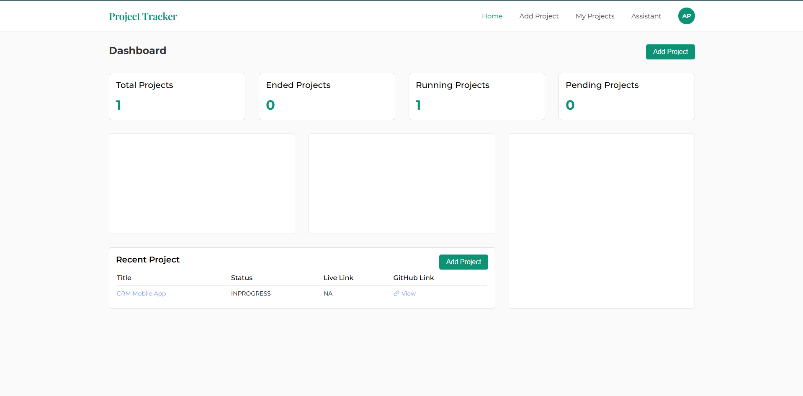
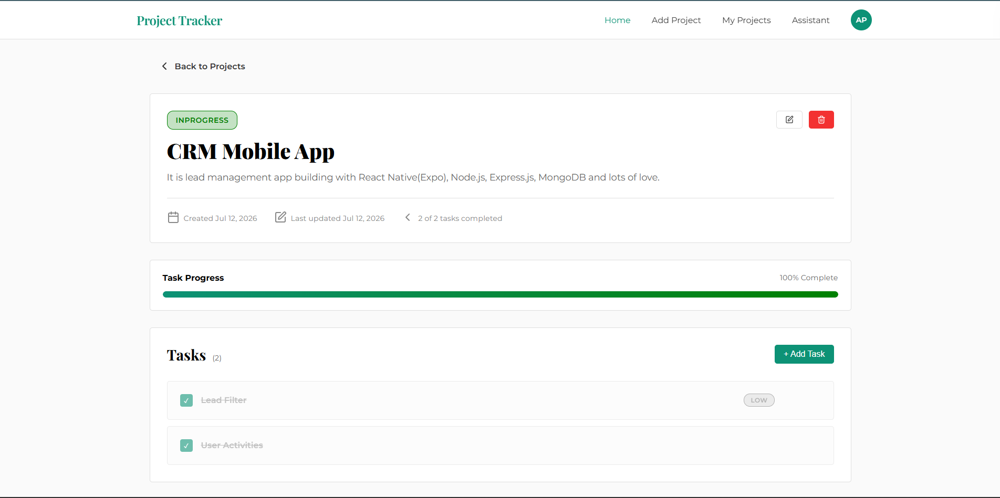

# Project Tracker

A modern web application to capture, organize, and manage your ideas, side projects, and startup concepts in one place.

## Live Demo
https://ideas-tracker-brown.vercel.app/

---

## Features

- User Authentication
- Create, edit, and delete ideas
- Organize ideas by category
- Set priority levels
- Track idea status
- Search and filter ideas
- Responsive design
- Fast and intuitive interface

---

## Tech Stack

### Frontend
- React.js
- Vite
- CSS
- React Router
- App Write

---

## Getting Started

### Clone the repository
```bash
git clone https://github.com/aslamparvej/Ideas-Tracker.git
cd Ideas-Tracker
```

### Install dependencies

```bash
npm install
```

### Configure Environment Variables

Create a `.env` file in the project root.

```env
VITE_API_URL=http://localhost:5000/api
```

### Start the development server

```bash
npm run dev
```

Open your browser and visit:
```
http://localhost:5173
```
---

## Project Structure
```
src/
├── assets/
├── components/
├── context/
├── hooks/
├── pages/
├── services/
├── utils/
├── App.jsx
└── main.jsx
```

---

## Screenshots

### Dashboard


### Project Details


---

## Future Improvements

- Dark Mode
- Labels & Tags
- Rich Text Editor
- File Attachments
- Kanban Board
- Calendar View
- AI-powered Idea Suggestions
- Team Collaboration

## Contributing
Contributions are welcome!

1. Fork the repository
2. Create your feature branch

```bash
git checkout -b feature/new-feature
```

3. Commit your changes

```bash
git commit -m "Add new feature"
```

4. Push to the branch

```bash
git push origin feature/new-feature
```

5. Open a Pull Request

## License

This project is licensed under the MIT License.

---

## Author

**Aslam Parvej**

GitHub: https://github.com/aslamparvej

---

If you like this project, don't forget to give it a star!